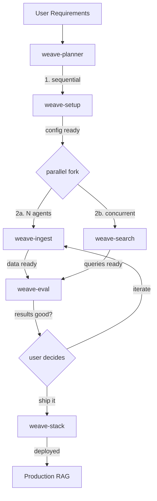

# weave-cli-skills

> v0.1.0 — OpenClaw skills for [weave-cli](https://github.com/Maximilien-ai/weave-cli)

Making any OpenClaw agent an expert in building multimodal RAG solutions across 10 vector databases.

## Skills

| Skill | Emoji | Description | Parallel? |
|-------|-------|-------------|-----------|
| [weave-setup](skills/weave-setup/) | ⚙️ | Install, config, doctor, .env, VDB selection | Sequential (first) |
| [weave-ingest](skills/weave-ingest/) | 🗄️ | Collections, schemas, chunking, pipeline ingest, backup | N agents |
| [weave-search](skills/weave-search/) | 🧠 | Queries, RAG/QA/summarize agents, search tuning | N agents |
| [weave-eval](skills/weave-eval/) | 🎯 | Datasets, evaluators, benchmarks, result analysis | N agents |
| [weave-stack](skills/weave-stack/) | 📦 | Stack init/up/down, k8s/podman, dashboard, day-2 ops | Sequential (last) |
| [weave-planner](skills/weave-planner/) | 📋 | End-to-end lifecycle planning, agent coordination | Orchestrator |

## Architecture



## Templates

| Template | Description |
|----------|-------------|
| [rag-team](templates/rag-team/) | ClawMax organization template — 5 agent roles, 6 groups, 6 workflows, parameterized scaling |

### RAG Team Roles

| Role | Skills | Scalable? |
|------|--------|-----------|
| RAG Planner | weave-planner, weave-setup | 1 (orchestrator) |
| Data Engineer | weave-ingest | 1-10 agents |
| Search Engineer | weave-search | 1-5 agents |
| Eval Engineer | weave-eval | 1-5 agents |
| Ops Engineer | weave-stack | 1 (infra) |

## Installation

### Prerequisites

- [weave-cli](https://github.com/Maximilien-ai/weave-cli) installed (`brew install Maximilien-ai/tap/weave-cli`)
- [ClawMax](https://github.com/Maximilien-ai/clawmax) dashboard running

### Import skills into ClawMax

**Via Dashboard UI:**
Skills > Import Skill > Local Directory > point to `skills/<skill-name>`

**Via API:**
```bash
for skill in weave-setup weave-ingest weave-search weave-eval weave-stack weave-planner; do
  curl -X POST http://localhost:3001/api/skills/import \
    -H "Content-Type: application/json" \
    -d "{\"sourcePath\": \"/path/to/weave-cli-skills/skills/$skill\"}"
done
```

**Via GitHub import:**
```bash
curl -X POST http://localhost:3001/api/skills/import-github \
  -H "Content-Type: application/json" \
  -d '{"url": "https://github.com/Maximilien-ai/weave-cli-skills", "subdir": "skills/weave-setup"}'
```

### Apply RAG Team template

1. Import all 6 skills (above)
2. Go to Templates > Organization Templates > RAG Team > Apply
3. Adjust team size (number of data/search/eval engineers)
4. Click Apply — agents created with skills wired automatically

## Supported Vector Databases (10)

Weaviate, Qdrant, Milvus, Chroma, Supabase, Neo4j, MongoDB Atlas, Pinecone, Elasticsearch, OpenSearch

## Tags

All skills tagged with: `rag`, `data`, `weave`, `vector-database`

## Created at

[OpenClaw Hack Day — March 25, 2026](https://luma.com/openclaw-hack-day-mar25-2026?tk=yAFIM0) (The Agent Toolkit w/ OpenAI Codex)

## License

See [LICENSE](LICENSE)
