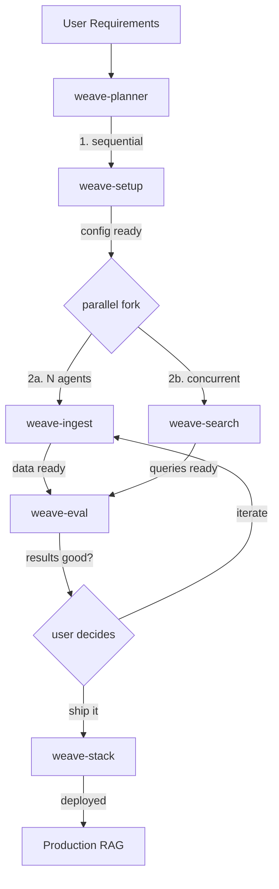

# weave-cli-skills

OpenClaw skills for [weave-cli](https://github.com/maximilien/weave-cli) — making any agent an expert in building multimodal RAG solutions across 10 vector databases.

## Skills

| Skill | Description | Parallel? |
|-------|-------------|-----------|
| [weave-setup](skills/weave-setup/) | Install, config, doctor, .env, VDB selection | Sequential (first) |
| [weave-ingest](skills/weave-ingest/) | Collections, schemas, chunking, pipeline ingest, backup | N agents |
| [weave-search](skills/weave-search/) | Queries, RAG/QA/summarize agents, search tuning | N agents |
| [weave-eval](skills/weave-eval/) | Datasets, evaluators, benchmarks, result analysis | N agents |
| [weave-stack](skills/weave-stack/) | Stack init/up/down, k8s/podman, dashboard, day-2 ops | Sequential (last) |
| [weave-planner](skills/weave-planner/) | End-to-end lifecycle planning, agent coordination | Orchestrator |

## Architecture



## Templates

| Template | Description |
|----------|-------------|
| [rag-team](templates/rag-team/) | ClawMax organization template — multiagent RAG team with parallel workflows |

## Installation

### Import into ClawMax (workspace custom skills)

```bash
# From ClawMax dashboard: Skills > Import > Local Directory
# Point to each skill directory under skills/
```

### Import via ClawMax API

```bash
curl -X POST http://localhost:3001/api/skills/import \
  -H "Content-Type: application/json" \
  -d '{"path": "/path/to/weave-cli-skills/skills/weave-setup"}'
```

### Import from GitHub

```bash
curl -X POST http://localhost:3001/api/skills/import-github \
  -H "Content-Type: application/json" \
  -d '{"url": "https://github.com/Maximilien-ai/weave-cli-skills", "subdir": "skills/weave-setup"}'
```

## Supported VDBs (10)

Weaviate, Qdrant, Milvus, Chroma, Supabase, Neo4j, MongoDB Atlas, Pinecone, Elasticsearch, OpenSearch

## Created at

[OpenClaw Hack Day — March 25, 2026](https://luma.com/openclaw-hack-day-mar25-2026?tk=yAFIM0) (The Agent Toolkit w/ OpenAI Codex)
